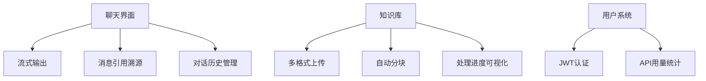

以下是为Cursor编写的增强版提示词，专为基于Deepseek API和现代化界面设计优化：

```markdown
# 项目需求：开发基于RAG的Deepseek问答网站

## 技术栈升级
1. **前端进化**：
   - React + TypeScript + Vite
   - UI库：shadcn/ui + Tailwind CSS + Framer Motion
   - 聊天体验：react-markdown + highlight.js (代码块支持)
2. **后端升级**：
   - FastAPI + Python 3.10+
   - 文档解析：Unstructured[md,pdf,docx] + PyMuPDF
   - 异步处理：Celery + Redis
3. **向量数据库**：ChromaDB 本地部署（带持久化）
4. **AI服务**：
   - Embedding：BAAI/bge-small-zh-v1.5
   - 生成模型：Deepseek API (chat)

## 现代化功能设计


## 视觉规范
1. **设计参考**：
   - Deepseek官网的蓝黑科技感
   - ChatGPT的对话流布局
   - Notion风格的操作面板
2. **核心要素**：
   - 主色：#0A84FF（Deepseek蓝）
   - 辅色：#1C1C1E（深灰）
   - 字体：Inter字体族
   - 间距系统：8px基准
3. **动效需求**：
   - 消息渐入动画（slideUp）
   - 加载状态骨架屏
   - 按钮微交互hover效果

## 开发步骤指南

1. **项目初始化**
```bash
# 前端
npm create vite@latest deepseek-rag -- --template react-ts
cd deepseek-rag
npm install @radix-ui/react-dropdown-menu framer-motion react-markdown highlight.js

# 后端
mkdir backend && cd backend
python -m venv .venv
source .venv/bin/activate
pip install "fastapi[all]" "unstructured[md,pdf,docx]" celery redis chromadb sentence-transformers
```

2. **核心代码结构**
```
├── frontend
│   ├── src
│   │   ├── features
│   │   │   ├── chat
│   │   │   │   ├── MessageBubble.tsx  # 带源码引用的气泡
│   │   │   │   └── StreamRenderer.tsx # 流式输出组件
│   │   ├── layouts
│   │   │   └── MainLayout.tsx         # 侧边导航布局
├── backend
│   ├── app
│   │   ├── models                    # Pydantic模型
│   │   ├── services
│   │   │   ├── deepseek.py           # API封装
│   │   │   └── chroma_manager.py     # 向量库操作
│   ├── worker.py                     # Celery任务
```

3. **RAG核心逻辑（backend/app/services/chroma_manager.py）**
```python
from langchain.text_splitter import RecursiveCharacterTextSplitter

class DocumentProcessor:
    async def process_file(self, file_path: str):
        """支持PDF/DOCX/Markdown的智能解析"""
        from unstructured.partition.auto import partition
        
        elements = partition(filename=file_path)
        text_splitter = RecursiveCharacterTextSplitter(
            chunk_size=500,
            chunk_overlap=50,
            separators=["\n\n", "。", "！", "？", "……"]
        )
        return text_splitter.split_documents(elements)
```

4. **Deepseek API封装（backend/app/services/deepseek.py）**
```python
import httpx

class DeepseekClient:
    def __init__(self, api_key: str):
        self.base_url = "https://api.deepseek.com/v1"
        self.headers = {
            "Authorization": f"Bearer {api_key}",
            "Content-Type": "application/json"
        }

    async def chat_stream(self, messages: list):
        async with httpx.AsyncClient() as client:
            data = {
                "model": "deepseek-chat",
                "messages": messages,
                "temperature": 0.7,
                "stream": True
            }
            async with client.stream("POST", 
                                   f"{self.base_url}/chat/completions",
                                   json=data, 
                                   headers=self.headers) as response:
                async for chunk in response.aiter_lines():
                    if chunk.startswith("data:"):
                        yield chunk[5:].strip()
```

5. **现代化聊天界面（frontend/src/features/chat/MessageBubble.tsx）**
```typescript
import { motion } from 'framer-motion'
import ReactMarkdown from 'react-markdown'
import remarkGfm from 'remark-gfm'

export function MessageBubble({ content, isUser }: { 
  content: string; 
  isUser?: boolean 
}) {
  return (
    <motion.div 
      initial={{ opacity: 0, y: 20 }}
      animate={{ opacity: 1, y: 0 }}
      className={`p-4 rounded-xl max-w-[80%] ${
        isUser 
          ? 'bg-blue-600 text-white ml-auto'
          : 'bg-gray-800 mr-auto'
      }`}
    >
      <ReactMarkdown
        remarkPlugins={[remarkGfm]}
        components={{
          code({ node, inline, className, children, ...props }) {
            return (
              <code className="bg-gray-700 px-2 py-1 rounded-md text-sm">
                {children}
              </code>
            )
          }
        }}
      >
        {content}
      </ReactMarkdown>
      {!isUser && (
        <div className="mt-2 text-xs text-gray-400">
          来源：doc_2024.pdf (第12页)
        </div>
      )}
    </motion.div>
  )
}
```

## 部署配置优化
```yaml
# docker-compose.yml
services:
  frontend:
    build: 
      context: ./frontend
      args:
        VITE_API_URL: ${API_URL}
    environment:
      - VITE_DEEPSEEK_ENABLED=true

  backend:
    environment:
      - DEEPSEEK_API_KEY=${API_KEY}
      - REDIS_URL=redis://redis:6379

  redis:
    image: redis:alpine

  celery:
    build: ./backend
    command: celery -A worker.celery worker --loglevel=info
```

## 需要Cursor协助的优先级
1. 实现类似Deepseek官网的渐变色头部导航栏
2. 创建可复用的流式对话组件（支持中途停止）
3. 配置PDF解析的Docker依赖（poppler-utils）
4. 添加JWT认证中间件
5. 实现知识库的统计仪表盘
6. 编写CI/CD流水线配置（GitHub Actions）

开发建议顺序：
1. 先完成Deepseek API的基础集成
2. 搭建核心聊天界面
3. 实现文件上传和处理流水线
4. 添加用户系统
5. 最后部署调优

性能优化重点：
1. 使用SWR进行前端数据缓存
2. 文档处理使用Celery后台任务
3. 配置Redis缓存高频查询
4. 实施请求限流（后端中间件）
``` 

请将以上内容分步骤输入Cursor，特别注意：
1. 首要注意API密钥的安全性（永远不要出现在前端）
2. 流式输出的实现要兼顾稳定性和用户体验
3. 文档解析需要处理中文标点换行问题
4. 界面设计保持与Deepseek官网一致的科技感

遇到具体实现问题时，可要求Cursor：
- 生成shadcn/ui组件的具体配置代码
- 编写错误边界处理逻辑
- 优化移动端触摸交互
- 生成Docker多阶段构建文件
- 创建性能监控仪表板